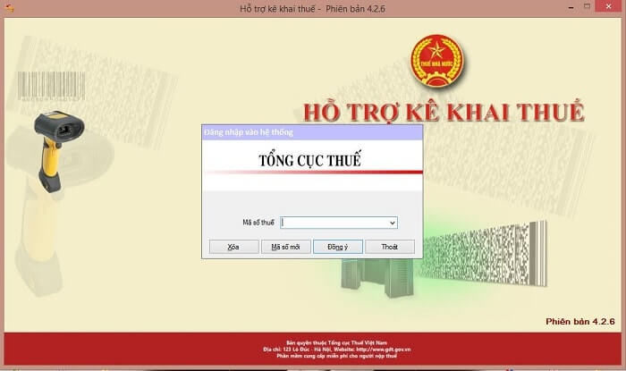

# ỨNG DỤNG HTKK - HỖ TRỢ KÊ KHAI THUẾ

## TÀI LIỆU HƯỚNG DẪN
- Tài liệu hướng dẫn cài đặt [Tải về](https://github.com/thuedientu/htkk/releases/download/v5.0.1/Tailieu_HD.cai.dat.HTKK.v4.2.pdf)
- Tài liệu HƯỚNG DẪN SỬ DỤNG ỨNG DỤNG HỖ TRỢ KÊ KHAI (Dành cho người nộp thuế) Phiên bản HTKK 5.x.x - Trước TT80 [Tải về](https://github.com/thuedientu/htkk/releases/download/v5.0.1/TaiLieu_HDSD_HTKK_TruocTT80_5.0.x.pdf)
- Tài liệu HƯỚNG DẪN SỬ DỤNG ỨNG DỤNG HỖ TRỢ KÊ KHAI (Dành cho người nộp thuế) Phiên bản HTKK 5.x.x - TT80 [Tải về](https://github.com/thuedientu/htkk/releases/download/v5.0.1/TaiLieu_HDSD_HTKK_TT80_V5.x.pdf)

## TẢI VỀ
Tải về các phiên bản [Tải về](https://github.com/thuedientu/htkk/releases)

# GIỚI THIỆU

## NỘI DUNG NÂNG CẤP ỨNG DỤNG HTKK 5.0.1 

1.	Tờ khai thuế thu nhập cá nhân – mẫu 06/TNCN (TT80/2021)
-	Bổ sung chức năng tải bảng kê đối với phụ lục 06-1/BK-TNCN
2.	Văn bản đề nghị hủy hồ sơ đề nghị hoàn thuế - mẫu 01/ĐNHUY (TT80/2021)
-	Cập nhật kết xuất đủ thông tin Tên cơ quan thuế.
3.	Tờ khai lệ phí môn bài – mẫu 01/LPMB (TT80/2021)
-	Cập nhật chức năng tổng hợp tờ khai bổ sung tổng hợp đúng giá trị Tăng/giảm số thuế phải nộp trong trường hợp thay đổi “Mức lệ phí”
4.	Tờ khai quyết toán thuế tài nguyên – mẫu 02/TAIN (TT80/2021)
-	Cập nhật tại phụ lục 01-1/TAIN: cập nhật khi lưu và kết xuất đúng định dạng số nguyên đối với chỉ tiêu
+	Chỉ tiêu [12] - Số thuế phải nộp cho từng tỉnh
+	Chỉ tiêu [12b] – Chênh lệch giữa số kê khai và số phải nộp quyết toán
5.	Biểu tổng hợp thông tin của thương nhân, tổ chức, cá nhân bán hàng hóa, dịch vụ trên sàn giao dịch TMĐT (01/CCTT-TMĐT)
-	Cập nhật độ dài tối đa của các trường dữ liệu trên màn hình nhập theo đúng quy định ban hành chuẩn xml

### NỘI DUNG NÂNG CẤP HTKK 4.7.8

1.	Nâng cấp bổ sung các mẫu biểu tờ khai quý theo Thông tư 80/2021/TT_BTC:
-	Tờ khai phí, lệ phí và các khoản thu khác do cơ quan đại diện nước Cộng hòa Xã hội Chủ nghĩa Việt Nam ở nước ngoài thực hiện thu (01/PHLPNG)
-	Tờ khai thuế thu nhập doanh nghiệp đối với hãng hàng không ở nước ngoài (01/HKNN)
-	Tờ khai thuế thu nhập doanh nghiệp đối với tổ chức nhận tái bảo hiểm nước ngoài (01/TBH)
-	Tờ khai phụ thu tạm tính (01/PTHU-DK)
-	Tờ khai thuế đối với hoạt động khai thác tài sản bảo đảm trong thời gian chờ xử lý (01/KTTSBĐ)
2.	Cập nhật một số nội dung phát sinh
-	Cập nhật tờ khai quyết toán thuế thu nhập doanh nghiệp (03/TNDN):
-	Cập nhật kết chuyển giá trị từ phụ lục lên các chỉ tiêu G1, G2, G3, G4.
-	Cập nhật chức năng in: Cập nhật in đúng tên phụ lục Thuế thu nhập doanh nghiệp được giảm là “Phụ lục Thuế thu nhập doanh nghiệp được giảm theo nghị quyết số 406/NQ-UBTVQH15”
-	Cập nhật tờ khai quyết toán thuế nhà thầu nước ngoài (02/NTNN):
-	Cập nhật không bắt buộc nhập cột [10] – số lượng lao động tại bảng kê 02-1/NTNN.
-	Cập nhật tờ khai quyết toán thuế thu nhập cá nhân (02/QTT-TNCN):
-	Cập nhật chức năng kết xuất XML đủ dữ liệu thông tin Người ký đã nhập.

### NỘI DUNG NÂNG CẤP HTKK 4.7.7

1. Nâng cấp tờ khai quyết toán thuế thu nhập doanh nghiệp (03/TNDN) theo Thông tư 80/2021/TT-BTC:
- Nâng cấp bổ sung chức năng kê khai tờ khai bổ sung thuế thu nhập doanh nghiệp (03/TNDN).
2. Cập nhật tờ khai thuế giá trị gia tăng (01/GTGT)
- Cập nhật chỉ tiêu [36] - Thuế giá trị gia tăng phát sinh trong kỳ: ứng dụng hỗ trợ tính theo công thức, nếu âm thì hiển thị đúng giá trị âm.
3. Cập nhật tờ khai quyết toán thuế tài nguyên đối với dầu khí (02/TAIN-VSP)
- Cập nhật định dạng nhập chỉ tiêu [28] – Giá tính thuế tài nguyên trong kỳ tính thuế: cập nhật định dạng cho phép nhập 6 số thập phân sau dấu phẩy
- Cập nhật không hiển thị cảnh báo đỏ tại chỉ tiêu [30] – Số tiền thuế tài nguyên phải nộp trong kỳ tính thuế trong trường hợp sửa giá trị trong ngưỡng cho phép.

http://www.gdt.gov.vn/wps/portal/home/hotrokekhai
